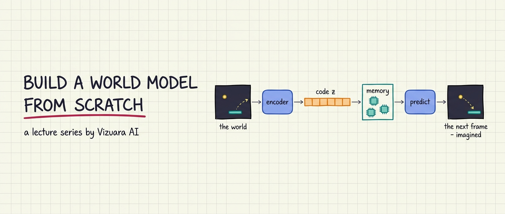
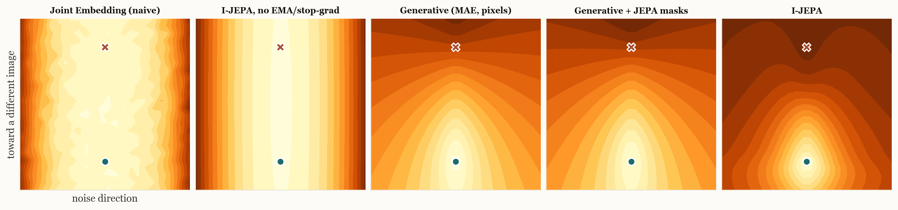

  

<h1 align="center">Build a World Model from Scratch</h1>

  <b>A lecture series by <a href="https://www.vizuara.ai">Vizuara AI</a></b> — slides, runnable code, and Colab notebooks. 
  Everything is built from first principles, every number on every slide is real output from the code in this repo.

  
  
  
  

---

## What is this?

A world model is a neural network that learns **how a world works** — well enough to predict what
happens next, and eventually well enough that an agent can plan, imagine, and train *inside* the
model instead of the real world. World models sit behind some of the most exciting results in
modern AI: Dreamer agents that learn in imagination, video models that simulate reality, robots
that rehearse before they act.

This series builds that entire idea up **from scratch** — small worlds, small networks, complete
code, honest engineering. No magic, no hand-waving, no "trust us, it works." When something broke
while we built it (and plenty did), the failure and the fix are part of the lecture.

## The lectures

Each lecture folder holds its slides, its runnable code, and a README with the full write-up.

| # | Lecture | Materials | What you'll learn |
|---|---------|-----------|-------------------|
| 0 | **Series Introduction** | [slides](lecture-00-series-introduction/lecture-00.pdf) | Why world models, the Renderer/Simulator/Planner map of the field, and where this series goes |
| 1 | **What Is a World Model, Really?** | [slides](lecture-01-what-is-a-world-model/lecture-01.pdf) · [code](lecture-01-what-is-a-world-model/code) | The agent–environment loop, why **state ≠ observation**, 80 years of the idea, and the taxonomy |
| 2 | **The World Modeler's Toolkit** | [slides](lecture-02-the-world-modelers-toolkit/lecture-02.pdf) | The four tools every world model stands on: latent spaces, reward over time, value, actor-critic |
| 3 | **Your First World Model** | [**write-up**](lecture-03-your-first-world-model) · [slides](lecture-03-your-first-world-model/lecture-03.pdf) · [notebook](lecture-03-your-first-world-model/pong_worldmodel.ipynb) | Build a complete world model on MiniPong: encoder + memory + prediction, then run it as the game |
| 4 | **Dreams That Last — the RSSM** | [**write-up**](lecture-04-dreams-that-last) · [slides](lecture-04-dreams-that-last/lecture-04.pdf) · [notebook](lecture-04-dreams-that-last/rssm_so101.ipynb) | Build an RSSM on **real SO-101 robot data**: track a belief, carry a memory and a doubt, dream 60 steps with the camera off |
| 5 | **A Vector, or a Vocabulary? — IRIS** | [**write-up**](lecture-05-a-vector-or-a-vocabulary) · [slides](lecture-05-a-vector-or-a-vocabulary/lecture-05.pdf) · [**play with it**](lecture-05-a-vector-or-a-vocabulary/simulator) | Discrete latents and transformers: give a world model a **vocabulary** instead of a vector, then open the transformer and trace one word through every layer |
| 6a | **The World Model in Your Head** | [**write-up**](lecture-06a-the-world-model-in-your-head) · [slides](lecture-06a-the-world-model-in-your-head/lecture-06a.pdf) | LeCun's blueprint, made runnable: what an **energy landscape** is, and the measured contours that show why predicting in representation space wins |
| 6 | **Stop Painting Pixels — I-JEPA** | [**write-up**](lecture-06-stop-painting-pixels) · [slides](lecture-06-stop-painting-pixels/lecture-06.pdf) · [code](lecture-06-stop-painting-pixels/code) | Build I-JEPA's ideas from scratch, watch **representation collapse** happen on purpose, and replicate the ImageNet study — including at 1% of labels |

More on the way — next, world models that predict the future without rendering it (V-JEPA, DINO-WM).

---

## Latest result — Lecture 6

Five encoders, identical training data, one exam: score how "surprised" each model is by
candidate answers to *what is behind the mask?* — the true content, or content from a different
image. Drawn as a map (light = calm, dark = surprised):

  

The collapsed models are stripes — blind to the very axis that matters (they rank the true answer
above an impostor at a coin-flip 0.500). I-JEPA digs the deepest well, centred on the truth:
**0.9998**. And its space is organized by meaning — a goose's nearest neighbours are herons, while
a pixel-trained model offers a gas mask and a cauliflower.

  

