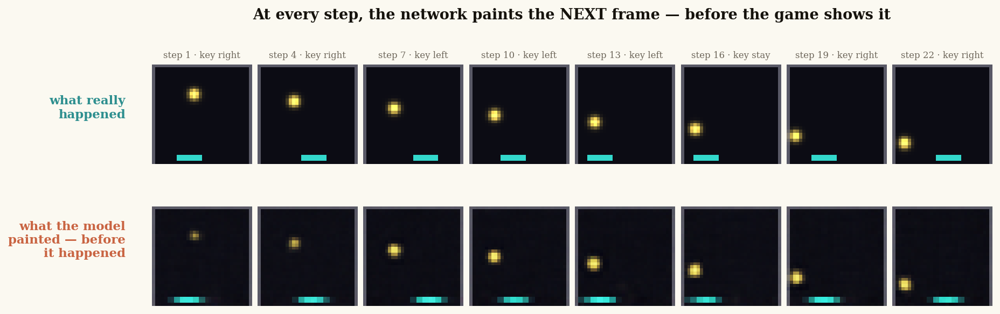
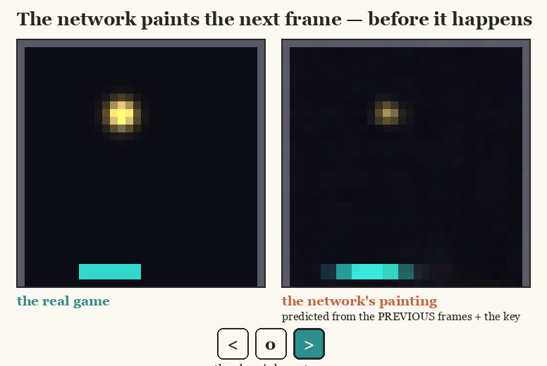
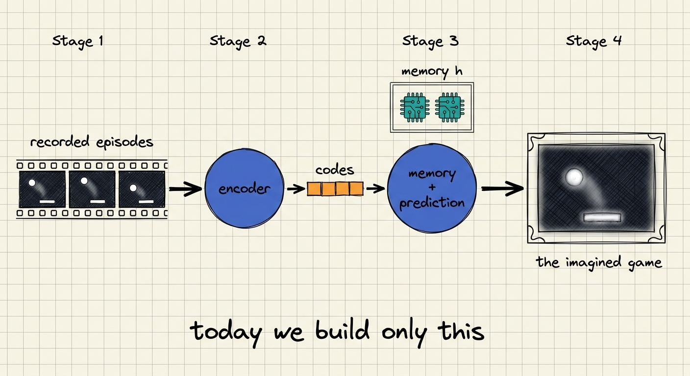
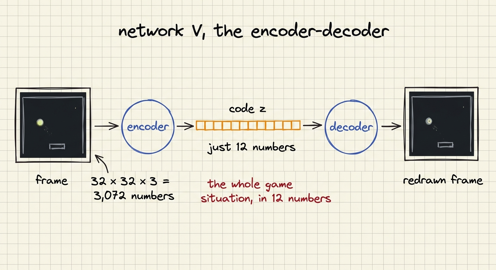
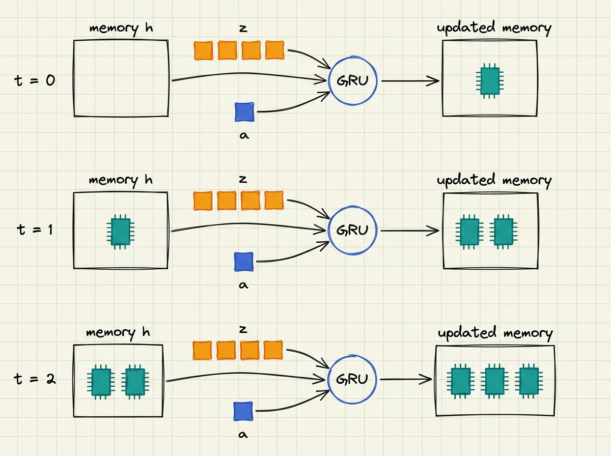
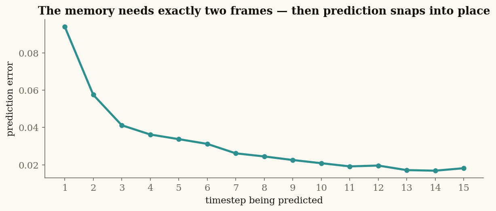
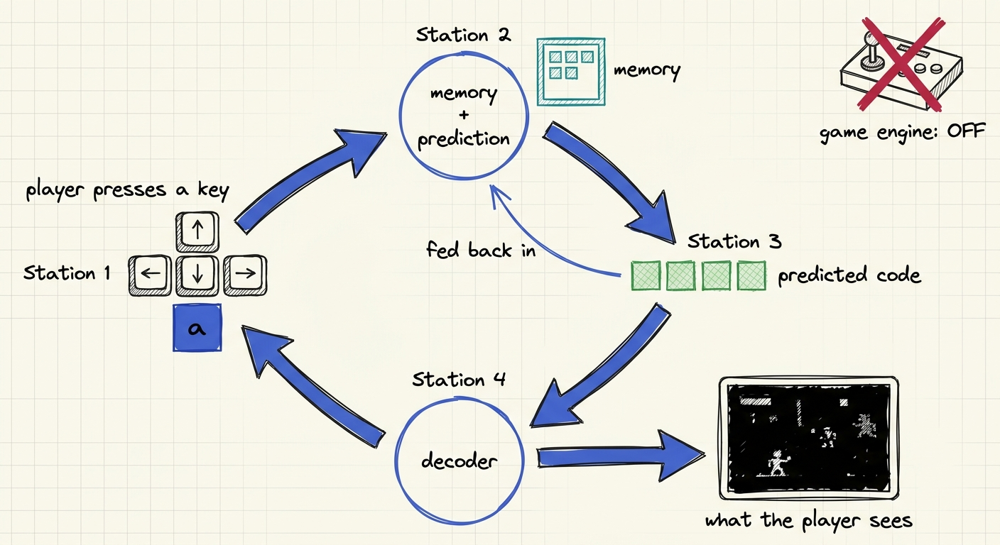

# Lecture 3 — Your First World Model

**[▶ Watch the lecture](https://www.youtube.com/@vizuara)** · [slides](lecture-03.pdf) ·
[notebook](pong_worldmodel.ipynb) ·
[](https://colab.research.google.com/github/RajatDandekar/build-a-world-model-from-scratch/blob/main/lecture-03-your-first-world-model/pong_worldmodel.ipynb)

Build a complete world model from scratch on MiniPong — an encoder, a memory, and a
prediction head — then switch the game engine off and run the model as the game.

> 🎥 **Companion:** Network V is built on the variational autoencoder. For the full
> treatment — intuition, math, and a from-scratch implementation — watch
> [Variational Autoencoder (VAE) from scratch](https://www.youtube.com/watch?v=VUwAGLM6K_8).

## The headline result 

Two small networks — **167,527 parameters total, trained in under ten minutes on a laptop CPU** —
learn a Pong-like world from 24,000 recorded frames and nothing else: no labels, no rewards, no
positions, no velocities.

At every step of an episode the model has never seen, it paints **what the next frame will look
like, before the game shows it** — ball position, ball direction, wall bounces, and the paddle's
response to the player's keys, all correct:

<p align="center">
  
</p>

<p align="center">
  
</p>

Run it yourself in one click:
[](https://colab.research.google.com/github/RajatDandekar/build-a-world-model-from-scratch/blob/main/lecture-03-your-first-world-model/pong_worldmodel.ipynb)
— free Colab CPU, ~10 minutes end to end, no installs.

## How the model works

The architecture is the classic **V + M** decomposition from Ha & Schmidhuber's 2018
*World Models* paper, built here in miniature:

<p align="center">
  
</p>

**Network V — the encoder-decoder.** Each 32×32×3 frame (3,072 numbers) is compressed into a
**code z of just 12 numbers**, and decoded back to prove nothing important was lost. Predicting
12 numbers is a far kinder task than predicting 3,072 pixels — this compression is the central
design idea of every world model since.

<p align="center">
  
</p>

> 🎥 **Go deeper on the encoder:** Network V is built on the variational autoencoder idea. For the
> full treatment — the intuition, the math, and a from-scratch implementation — watch Vizuara's
> dedicated lecture: [**Variational Autoencoder (VAE) from scratch | Intuition + Coding**](https://www.youtube.com/watch?v=VUwAGLM6K_8).

**Network M — memory + prediction.** A single frame shows *where* the ball is, never *where it
is going* — velocity lives only in the difference between frames. So M carries a **memory h
(128 numbers) that persists across timesteps**, updated by a GRU at every step. After two frames
the memory holds the difference between two positions. That difference *is* the velocity: no
frame ever showed it, the network derived it, because prediction is impossible without it.

<p align="center">
  
</p>

The proof is measurable. Prediction error is **large at t=1** (velocity is unknowable from one
frame), then **collapses once the memory has seen two frames** — 0.094 → 0.041 by t=3 → 0.021
at t=10 in our run (and in yours, same seed):

<p align="center">
  
</p>

**Deployment — the closed loop.** Switch the game engine off and feed the model's predictions
back in as its own next inputs: the model *becomes* the game. The paddle obeys the player
indefinitely; the imagined ball holds for the first steps, then drifts — tiny errors compound
every time the model eats its own output. **That compounding-error problem is the central open
problem of world models**, and it is precisely where the next lectures pick up.

<p align="center">
  
</p>

## The honest engineering

Every one of these came from a real failure we hit while building this — each is now lecture
material, and each is a lesson that generalizes far beyond Pong:

1. **Compression keeps what the loss pays for.** Our first encoder produced perfect paddles and
   *no ball* — the ball is a handful of pixels, and dropping it cost the loss almost nothing.
   Fix: weight the ball's pixels up. Watch for this failure in every model you ever train.
2. **Normalise the code dimensions.** The big busy paddle dominated the code's variance and the
   loss ignored the ball's quiet dimensions.
3. **Training in open loop and running in closed loop are different sports.** A model with
   near-perfect one-step predictions can still collapse when it eats its own outputs. Practise
   the closed loop during training, and decode predictions back to pixels to keep them honest.
4. **Predict the *change* in the code, not the code.** Under uncertainty, MSE's safest answer
   drifts toward the dataset average — an invisible smeared ball. Predicting changes makes the
   safe answer "nothing moves," which keeps the ball painted.
5. **The world itself must be learnable.** Random ball respawns are unlearnable for a
   deterministic predictor (it predicts the average of all futures — a future that never
   happens), and integer-snapped motion creates isolated islands of codes where predictions
   landing between islands paint nothing. Deterministic physics + smooth sub-pixel motion fixed
   both.

## Running it

```bash
# the full build, ~8 minutes on a laptop CPU
cd code && python pong_worldmodel.py
```

The notebook is the same code wrapped in a guided narrative — regenerate it with
`python make_ipynb.py`.
