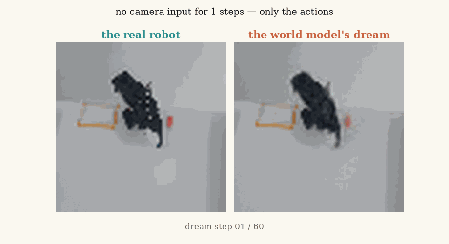
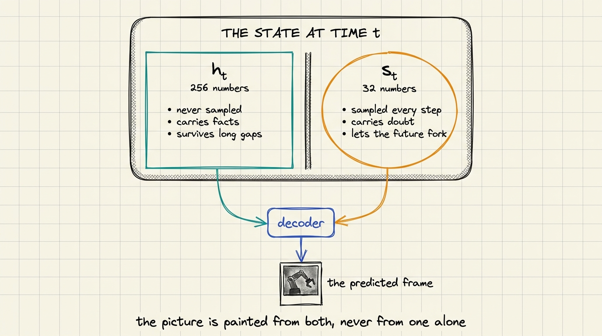
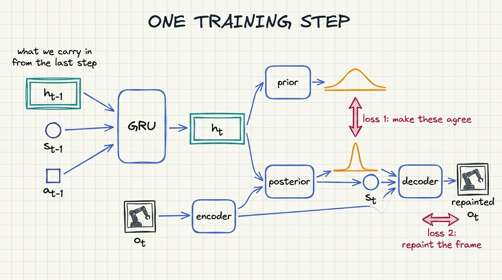
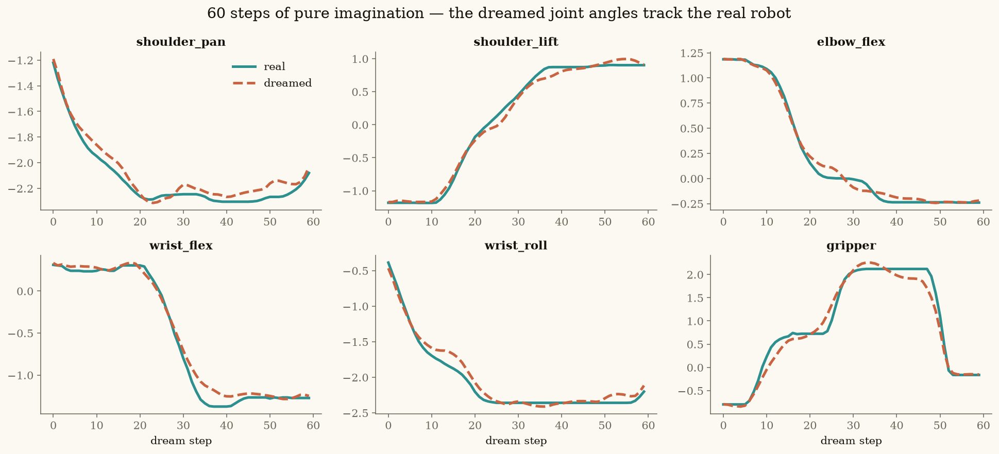
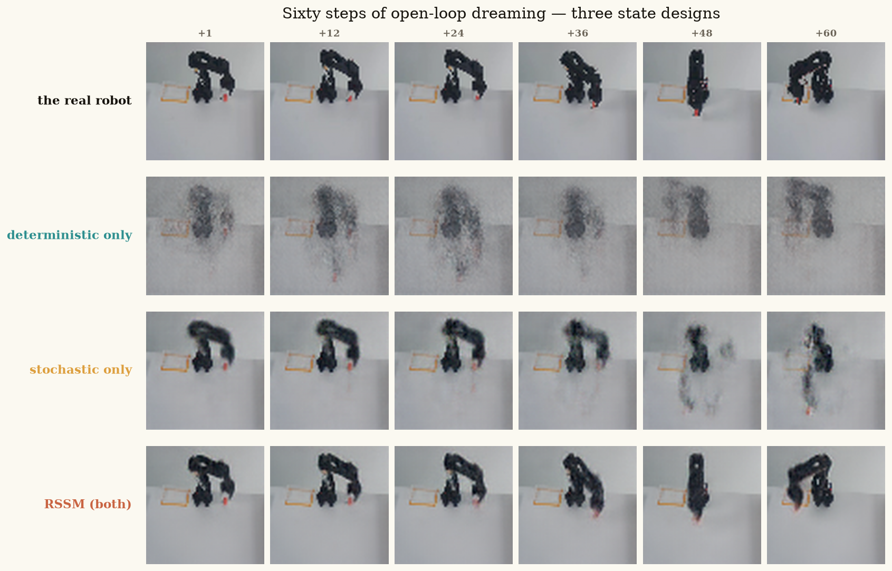
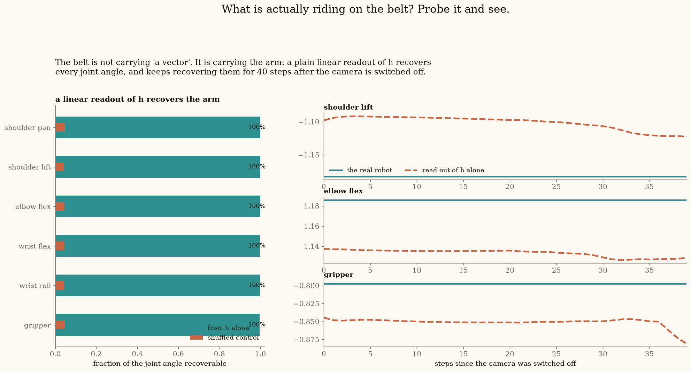

# Lecture 4 — Dreams That Last: the RSSM

**[▶ Watch the lecture](https://www.youtube.com/@vizuara)** · [slides](lecture-04.pdf) ·
[notebook](rssm_so101.ipynb) ·
[](https://colab.research.google.com/github/RajatDandekar/build-a-world-model-from-scratch/blob/main/lecture-04-dreams-that-last/rssm_so101.ipynb)

Lecture 3 ended on an honest failure: predictions that were near-perfect one step ahead, and a
dream that dissolved within a handful of steps. This lecture fixes it — and does the whole thing
on **real robot data**.

<p align="center">
  
</p>

Given five frames of context and then **nothing but the joint commands**, the model imagines two
full seconds of an SO-101 pick-and-place it has never seen.

*Paper: Hafner et al., [Learning Latent Dynamics for Planning from Pixels](https://arxiv.org/abs/1811.04551) (PlaNet), 2019.*
*Data: [lerobot/svla_so101_pickplace](https://huggingface.co/datasets/lerobot/svla_so101_pickplace) — 50 episodes, 11,939 frames, Apache-2.0.*

---

## The one idea: a state with two halves

<p align="center">
  
</p>

At every timestep the model carries **one state made of two parts**:

* **h** — 256 numbers, updated by a GRU, **never sampled**. Facts live here: the arm's pose, the
  cube's position, everything that must survive an occlusion.
* **s** — 32 numbers, **sampled every step** from a distribution computed *from h*. Doubt lives
  here: it is what lets the model say "this could go two ways" instead of averaging two futures
  into a blur.

They are literally concatenated — the decoder reads `[h, s]` — and they feed each other. The
memory decides how uncertain to be, and the sample flows into the next memory, so **a doubt once
resolved becomes a remembered fact**. That property is what keeps a long dream self-consistent.

## Two loss terms, and neither is optional

<p align="center">
  
</p>

The dataset contains no state labels — nobody can tell you what those 288 numbers should be. So
the training signal is built from two things we *do* have:

1. **Repaint the frame.** Decode the state back to an image and compare with what the camera saw.
   This forces the state to *contain* the world. Lecture 3 had exactly this term — and still failed.
2. **Ask the same question twice.** Compute the state once *with* the frame (the **posterior**) and
   once *without* it (the **prior**), then minimise the gap. There is no way to win that game
   except to genuinely carry forward whatever determines the next frame — which is what predicting
   means. It also punishes the encoder for representing things the prior could never anticipate, so
   perception is pushed toward *predictable* representations.

**Loss 1 fills the state. Loss 2 makes what is in it forecastable.**

## Results

### The dream holds for 60 steps

<p align="center">
  
</p>

All six joints tracked across two seconds of imagination on a held-out episode — including the
gripper's sharp contact event, predicted at the right timestep without ever seeing a frame of it.
Joint error stays flat (≈0.002–0.02) instead of compounding; on some episodes the error at step 60
is *lower* than at step 30, meaning the dream re-converges toward reality.

### The ablation: it really is the state design

We trained all three designs ourselves — same data, same 16,000 steps, same seed, matched
parameter counts — changing only what the state is made of:

| design | parameters | pixel error @60 | **joint error @60** |
|---|---|---|---|
| deterministic only | 7,718,313 | 0.0106 | 0.409 |
| stochastic only | 7,543,881 | 0.0155 | 2.598 |
| **both — the RSSM** | 7,665,993 | **0.0050** | **0.009** |

**45× better than deterministic-only and 288× better than stochastic-only.** Note also that pixel
error separates the three far less than joint error does — pixels are dominated by the static table
and background, while the *robot* is where the designs differ. Choose the metric that measures the
thing you care about.

<p align="center">
  
</p>

### What the memory actually carries

<p align="center">
  
</p>

Rather than assert that a recurrent state "carries information", we probed it: fit a plain
**linear** readout from `h` to the six true joint angles. It recovers **99.9% of every joint**,
against a shuffled control at zero — and keeps recovering them 40 steps after the camera is
switched off. The memory is not a vague summary; it literally carries the arm.

## What we measured, and what we did not

We expected the model's uncertainty to **spike at contact** — the grasp is where the future
genuinely forks. Averaged over the state's dimensions, it does not. What we *did* see is real: at
the very first timestep, with no history, uncertainty is at its maximum and **one frame collapses
it**. Why the contact spike is missing is open — either the forks live in a few dimensions the
average washes out, or 50 episodes of a reliably successful grasp contain little to be unsure
about. Both are testable; see the notebook's exercises.

## The build log

[**NOTES.md**](NOTES.md) is the honest version of this page: every dead end in the order we hit
it, the two Modal traps that cost us a training run, the metric that nearly fooled us, and the
result we expected but could not measure.

## Reproducing it

The notebook runs on a free Colab and downloads everything it needs (a 12-episode data subset and
the trained checkpoint). For the full pipeline on a GPU:

```bash
pip install modal
modal run --detach code/modal_rssm_pilot.py     # prepare data + train + evaluate
modal run --detach code/modal_ablation.py::run_all   # the three-design comparison
modal run --detach code/modal_deep_figs.py::make     # the probe + forward-pass figures
modal run --detach code/modal_teaching_figs.py::make # the belt / dice / cut-a-path figures
```

Two things that cost us time, in case they save you some: don't pin `torch` in an image that
installs `lerobot` (it breaks torchcodec's ABI), and `modal run --detach` only keeps the **last**
triggered function alive — wrap a multi-stage job in one function.

## Files

```
lecture-04.pdf            the 70-slide deck as taught
rssm_so101.ipynb          the guided Colab companion
code/rssm_so101.py        the notebook's source (percent format)
code/modal_*.py           training, ablation, and figure generation
data/                     12-episode subset + the trained checkpoint
assets/                   every figure in the lecture, plus film.mp4
```
