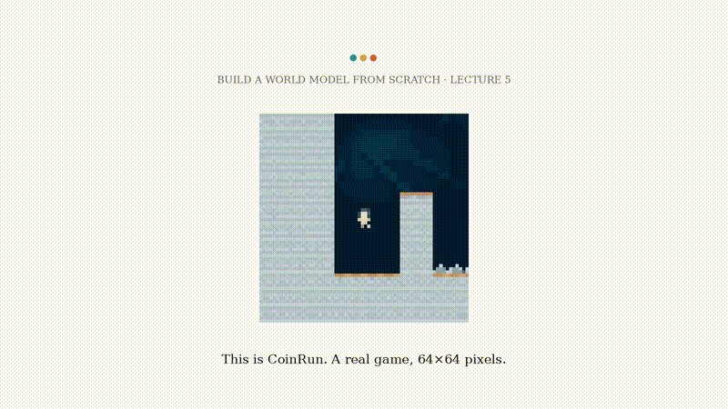
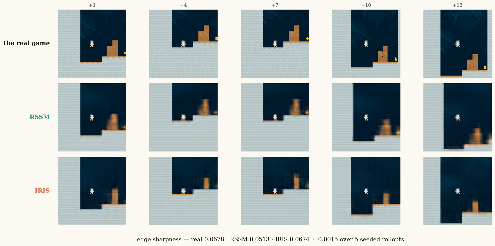
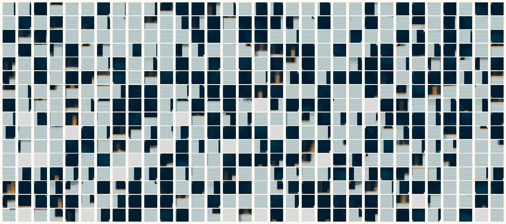
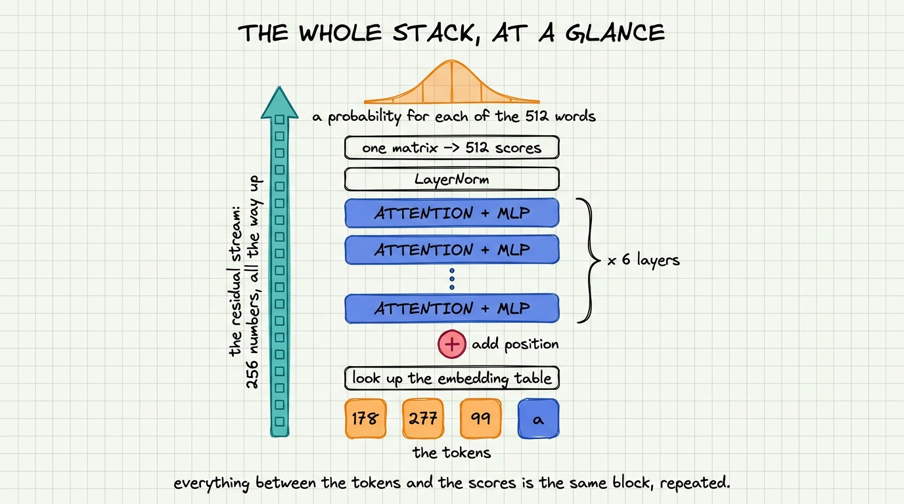
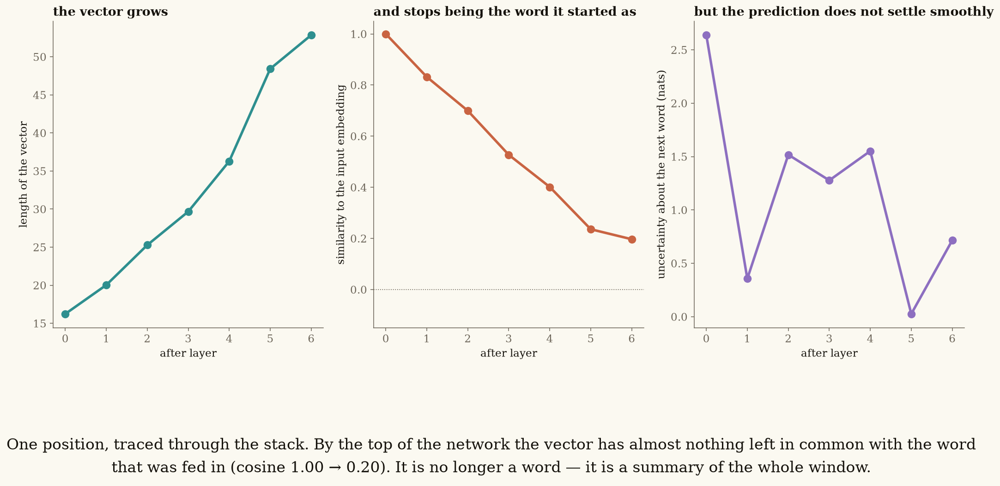
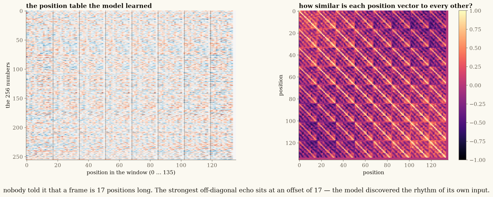

# Lecture 5 — A Vector, or a Vocabulary? (IRIS)

**[▶ Watch the lecture](https://www.youtube.com/@vizuara)** · [slides](lecture-05.pdf) ·
[**play with the world model**](simulator) · [build log](NOTES.md)

Four lectures in, every world model we had built carried the same thing between timesteps: a small
bundle of **continuous numbers**, updated by a recurrent network. It worked — and the dreams came
out slightly *soft*. This lecture finds out why, and the answer turns out to be the shape of the
latent itself.

<p align="center">
  
</p>

So we change both things we had never questioned: **what the state is made of** (a point in space,
or a word from a list) and **how the model reads its own past** (a running summary, or a window it
can look back through). Then we train both designs on the same game and measure everything.

*Paper: Micheli et al., [Transformers are Sample-Efficient World Models](https://arxiv.org/abs/2209.00588) (IRIS), 2022.*
*Data: 600 CoinRun episodes (Procgen) under a random policy — 256,151 frames, generated by the code here.*

---

## Steer the dream yourself

<p align="center">
  
</p>

`simulator/index.html` opens from disk — no server, no network, no install. Both models are primed
on the same eight real frames, then **you** press left / right / jump and watch each one imagine
what happens next. **3,279 genuine rollouts**, depth 7, every branch actually run through both
networks on a GPU ahead of time.

One thing it teaches immediately: for the first two presses the branches look identical. That is
not a bug — each token covers a 16×16 patch, and one frame of player movement is a few pixels. By
step 3 the three futures differ in **12.7 of 16 tokens**, by step 6 in **14.3**. The continuous
model shows the same delay, so it is a fact about the world and the resolution, not about
discreteness.

---

## The one idea: a point on a map, or a word from a list

A **continuous** latent is a point in space. It interpolates — "halfway between" is a real, usable
state — and when the model is unsure between two futures, it must answer with a single point. The
average of two sharp frames is a soft frame. *That is where Lecture 4's blur came from.*

A **discrete** latent is a symbol chosen from a finite list. There is nothing between two entries —
but it can say "either this or that, and nothing in between", because it outputs a probability for
every word in the vocabulary.

<p align="center">
  
</p>

Above is the **entire vocabulary** our model invented for CoinRun, unsupervised, from raw frames.
Each square is one word, drawn as the average of the real 16×16 patches assigned to it across
34,560 held-out patches. Nobody labelled any of it.

A frame becomes **16 of these words**. Held-out reconstruction from those 16 integers: **MSE
0.00081**. Codebook perplexity **472 of 512**, all 512 codes alive — no collapse.

---

## Inside the transformer

The longest part of the lecture opens the stack and traces **one real forward pass**, layer by
layer, on the trained model. Nothing in it is a schematic.

<p align="center">
  
</p>

Three results worth the trip:

**The residual stream is the "context vector".** At the sampling position the vector always has 256
numbers — that never changes — but its *magnitude* grows 16.2 → 52.8 while its similarity to its own
input embedding falls **1.00 → 0.20**. It starts as one word and ends as a summary of the whole
window.

<p align="center">
  
</p>

**A division of labour nobody designed.** Share of attention landing inside the newest frame, layer
1 → 6: **25% · 52% · 64% · 61% · 99% · 74%**. Early layers reach back across history; later layers
settle onto the frame being finished. That emerged from the loss.

**The model found its own rhythm.** The positional table is initialised to *zeros* — no sine waves,
nothing imposed. After training, the strongest similarity across all offsets beyond ten sits at
**exactly 17**: sixteen picture words plus one action. It recovered the structure of its own input
from next-token prediction alone.

<p align="center">
  
</p>

---

## The head-to-head

Same game, same data, same wall-clock, comparable size.

| | Model A · RSSM | Model B · IRIS-mini |
|---|---|---|
| state | 32 continuous numbers (Gaussian) | 16 words from a 512-word codebook |
| dynamics | GRU | causal transformer, 6 layers, 8 heads |
| parameters | 5,364,035 | 6,882,499 |
| imagined frames / sec | **5,600** | 27 |
| dream sharpness (real = 0.068) | 0.051 | 0.067 ± 0.002 |

**Sharpness went the way the theory predicts.** The RSSM lands well below the real game — too
smooth, which is what averaging futures looks like. IRIS lands essentially level with it.

**And the throughput gap is not what everyone assumes.** It is *not* attention's quadratic term: we
measured 28.2 / 28.3 / 28.2 fps at context lengths of 2, 4 and 8 frames — flat. At 136 positions the
sequence is far too short for that to bite. The 200× is entirely the **sixteen sequential decodes**
needed for one imagined frame. One GRU step versus sixteen forward passes.

Nobody wins, and that is why all four corners of the design space are still occupied in 2026.

---

## Run it yourself

```bash
# Parts 1 & 2 — laptop CPU, ~2 minutes, no GPU, no download
python3 code/text_demos.py

# Parts 4 & 5 — one A10G on Modal
modal run --detach code/modal_coinrun.py::gen_data
modal run --detach code/modal_coinrun.py::train_rssm  --steps 12000
modal run --detach code/modal_coinrun.py::train_iris  --tok-steps 20000 --gpt-steps 60000
modal run --detach code/modal_coinrun.py::compare     # the comparison figures
modal run --detach code/modal_coinrun.py::internals   # the layer-by-layer trace
modal run --detach code/modal_coinrun.py::simulator   # the rollout tree for the demo
```

`code/assemble.py` substitutes every measured number into the slides from `stats.json` and **fails
the build** if a placeholder cannot be filled, so no slide can ship with an invented figure on it.
`code/gate.py` checks the rendered PDF for blank pages, text-over-text collisions, silent
truncation and part-label drift.

---

## What broke while building this

Two bugs that would have shipped silently, and one figure that showed nothing. All three are
written up in **[NOTES.md](NOTES.md)**, along with a claim the data killed and a check that sat
dead in the gate for hours because it never matched anything. Short version:

- The transformer's loss mask **excluded the one position that predicts the next frame**. It learned
  to finish a frame and nothing about how frames follow each other — while cross-entropy looked
  perfectly healthy.
- The dream sampler called the model 16 times per frame but never appended the sampled token, so all
  16 words were i.i.d. draws from the same distribution.
- Every "here is what one word looks like" tile was a **flat grey wash**, because decoding a single
  codebook vector hands the decoder a constant field. Real model output; visually nothing.

---

<p align="center">
  <a href="../lecture-04-dreams-that-last">← Lecture 4 · Dreams That Last</a> ·
  <a href="..">the series</a>
</p>
