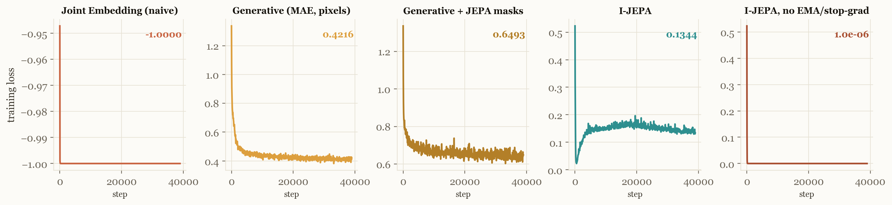
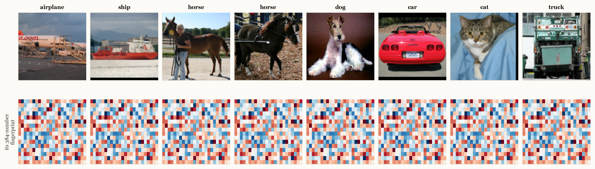
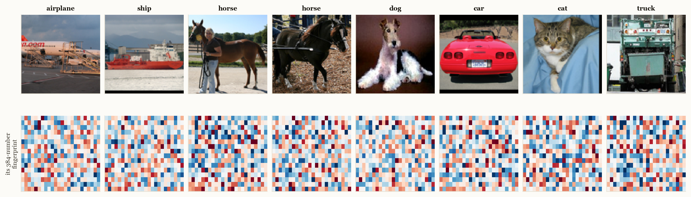
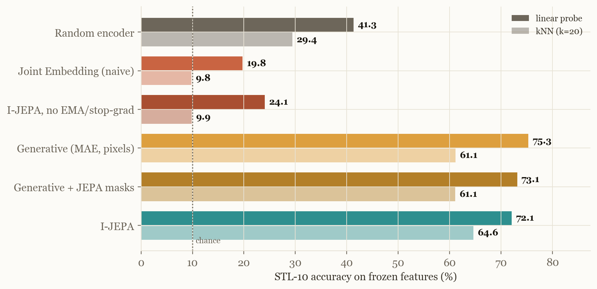
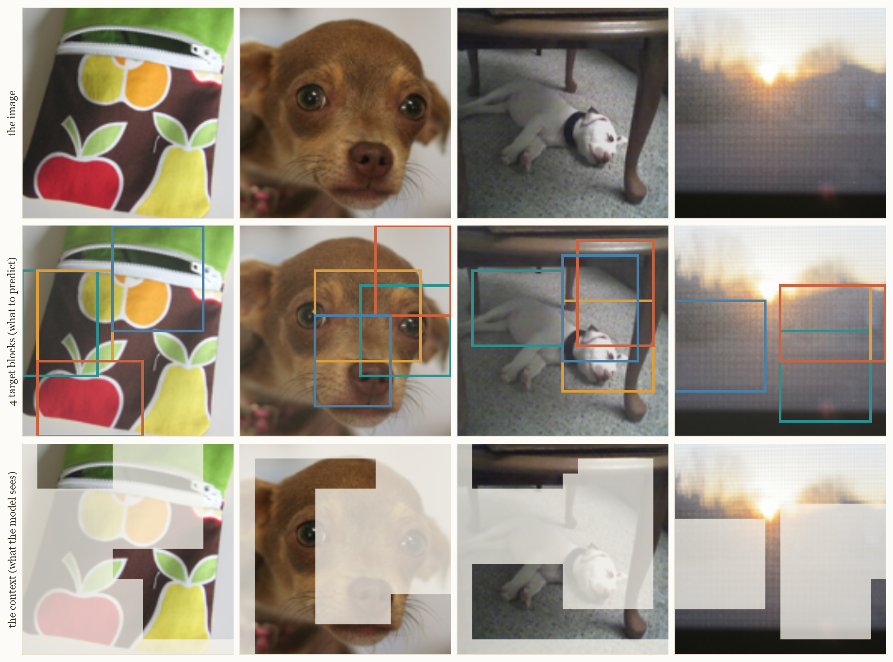
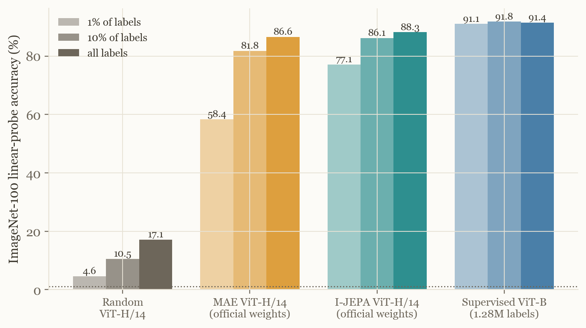
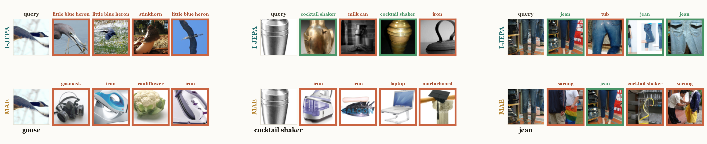

# Lecture 6 — Stop Painting Pixels (I-JEPA)

**[▶ Watch the lecture](https://www.youtube.com/@vizuara)** · [slides](lecture-06.pdf) ·
[code](code) · [raw results](results) · prequel: [Lecture 6a](../lecture-06a-the-world-model-in-your-head)

Five lectures in a row, we trained models to put the pixels back: the VAE, the MDN-RNN, the RSSM,
IRIS — the architecture changed four times, the training signal never did. This lecture changes
the **loss** instead: predict in representation space, never paint a pixel. We build I-JEPA's
ideas from scratch, break them on purpose, and replicate the study that made the paper famous.

*Paper: Assran et al., [Self-Supervised Learning from Images with a Joint-Embedding Predictive
Architecture](https://arxiv.org/abs/2301.08243) (I-JEPA), 2023.*
*Data: STL-10 (100,000 unlabeled images) for the controlled study; ImageNet-100 (~127k images,
100 classes) for the replication. All training on cloud GPUs; every number below is output of the
code in this repo.*

---

## Five objectives, one encoder

One ViT-S encoder, one dataset, one optimizer, one seed, 100 epochs — only the training objective
changes: naive joint embedding, MAE, MAE with I-JEPA's block masks, I-JEPA, and I-JEPA with its
anti-collapse guard removed. Then every encoder takes the same exam.

**The loss curves lie.** The two broken runs post the *best* losses of all five (−1.0 is a perfect
cosine loss; 1.0×10⁻⁶ a near-perfect prediction loss):

<p align="center">
  
</p>

**The fingerprints don't.** Eight real test images, and the embedding each run assigns them —
the collapsed joint embedding gives all eight the *same* vector (pairwise similarity 1.000):

<p align="center">
  
  <br>
</p>

**The verdict** (frozen features, linear probe + kNN, with the baseline everyone forgets — an
untrained random encoder):

<p align="center">
  
</p>

Training the unguarded runs made them *worse than an untrained network* (19.8 / 24.1 vs 41.3).
And an honest surprise we kept on the slides: at this toy scale the pixel objectives match I-JEPA
on a linear probe — the latent-target advantage is a **scale** claim, which the replication below
settles.

## The masking strategy, reproduced

Four target blocks (15–20% of the image each), one large context block, targets deleted from the
context — our own collator on real ImageNet-100 images (reproduces the paper's Figure 4):

<p align="center">
  
</p>

## The ImageNet replication

Frozen **official checkpoints** (I-JEPA ViT-H/14 and MAE ViT-H/14), our probe protocol,
ImageNet-100, at three label budgets:

<p align="center">
  
</p>

The paper's claim replicates and **widens when labels get scarce**: 88.3 vs 86.6 with all labels,
**77.1 vs 58.4 at 1% of labels**. The kNN gap is the dramatic one — 84.5 vs 30.7 — and here is
what it looks like: nearest neighbours in each frozen space (I-JEPA organizes by *meaning*, MAE
by *texture*):

<p align="center">
  
</p>

We also pretrained I-JEPA **from scratch** on ImageNet-100 (ViT-S/16, 150 epochs, one GPU,
2.7 hours): linear probe **59.1%** vs 18.8% for the same encoder untrained — the paper's
pretrain-then-probe pipeline reproduces end-to-end in our hands.

## Reproduce it

```
code/modal_app/        Modal app: five objectives, probes, energy study, dumps
code/modal_app/ijepa/  ViT, multi-block collator, the five losses, probes
code/analysis/         every figure, regenerated from raw logs; the numbers gate
code/tests/            27 CPU checks (masking, shapes, gradient routing, EMA)
results/               training logs, probe results, energy maps — the raw data
```

Runs live on [Modal](https://modal.com) (any GPU cloud works — the training loop is plain
PyTorch). The discipline that kept us honest: every number on every slide is recomputed from the
raw logs by `analysis/make_figures.py` and gated by `analysis/verify_deck.py`; runs are only ever
compared at the largest step both reached; a random-encoder probe ships with every experiment.

Code-vs-paper footnotes we kept and disclose: the official implementation uses `smooth_l1_loss`
(the paper says L2) and applies an undocumented `layer_norm` to the teacher's outputs. Both are
in our training script, clearly commented.
