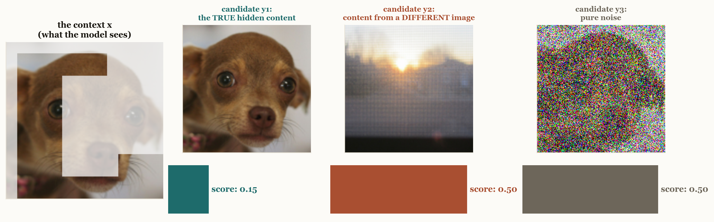
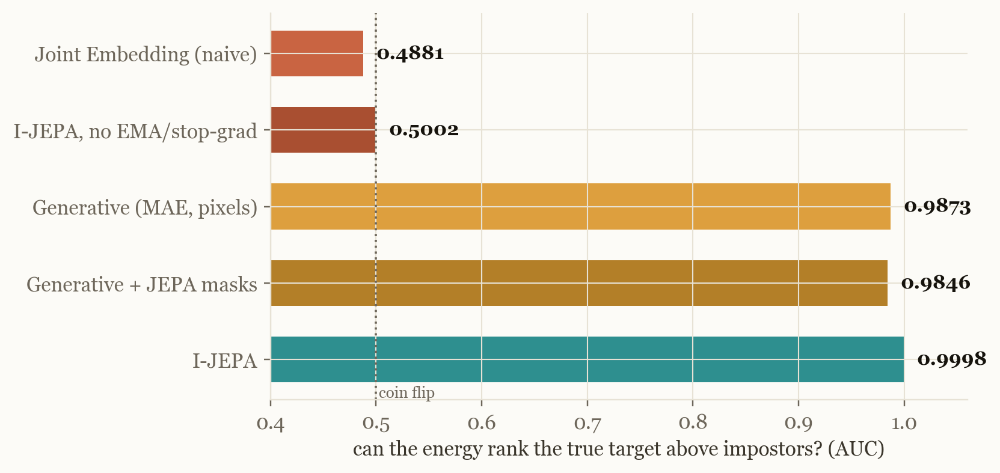

# Lecture 6a — The World Model in Your Head (the path to JEPA)

**[▶ Watch the lecture](https://www.youtube.com/@vizuara)** · [slides](lecture-06a.pdf) ·
[code & raw results](../lecture-06-stop-painting-pixels/code)

Yann LeCun's position paper — *A Path Towards Autonomous Machine Intelligence* — makes a beautiful
argument: brains run predictive world models, a world model is really an **energy function**, and
the right place to predict is representation space. The paper contains **zero runnable examples**.
This lecture builds the argument step by step and lands on one picture, **measured by us on real
encoders**, that says it all.

*Paper: LeCun, [A Path Towards Autonomous Machine Intelligence](https://openreview.net/forum?id=BZ5a1r-kVsf), 2022.*

---

## Energy, before any symbols

Give a trained world model a quiz: a real image with a hidden block, and three candidates for
what's behind the mask. A good model should be **calm** about the truth and **surprised** by the
impostors. These are our trained I-JEPA's actual surprise scores:

  

That surprise score is all "energy" means: **E(x, y)**, low = plausible. Training has an easy half
(push E down on real pairs) and a hard half (keep it high everywhere else) — and every
self-supervised architecture is a different answer to the hard half.

## Three contestants, one exam

We trained the architectures of the next lecture on 100,000 real images, then drew each one's
energy map around real targets: walk from the true target toward a different image, and toward
noise, scoring every point.

| contestant | what its map shows |
|---|---|
| joint embedding, no guard | **flat** — it collapsed; eight different images get one identical embedding (similarity 1.000) |
| generative (MAE) | a genuine well — but graded in **pixel space**, where a blade of grass costs as much as the dog |
| **I-JEPA** | the **deepest, tightest well**, centred on the truth, dug in representation space |

  

LeCun's phrase *"energy contours concentrated around the data"* is not a metaphor. It is this
picture — and I-JEPA is the architecture that actually achieves it. Reduced to one number
(can the energy rank the true target above 256 impostors?): collapsed models score a coin flip
(0.488 / 0.500); I-JEPA scores **0.9998**.

  

## What lives in I-JEPA's space

The nearest neighbours of real images, straight from the cosine-similarity matrix over the
official checkpoints' features — I-JEPA's neighbours share *meaning* (the goose gets herons),
MAE's share *texture* (the goose gets a gas mask and a cauliflower):

  

## Reproduce it

All code, checkpoint logs and the energy-measurement tooling live with the next lecture:
[`../lecture-06-stop-painting-pixels/code`](../lecture-06-stop-painting-pixels/code). The energy
study is `modal_app/ijepa/energy.py`; every number on every slide is recomputed from raw logs and
gated (`analysis/verify_deck.py`). A bonus `toyworld/` package (a tiny bimodal ball world used in
an earlier draft of this lecture) is included for the curious.

*Next: [Lecture 6 — Stop Painting Pixels](../lecture-06-stop-painting-pixels): we build I-JEPA
from scratch and replicate its ImageNet study.*
