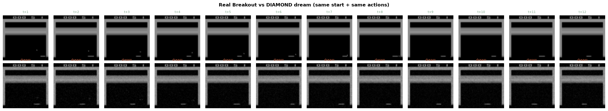

# Lecture 11 — DIAMOND: Diffusion as a World Model

> **Watch:** [Lecture 11 on YouTube](https://youtu.be/DGezk2XI6v0) · [full playlist](https://www.youtube.com/playlist?list=PLahzD_BXtne4)
> **Paper:** Alonso et al. — [Diffusion for World Modeling: Visual Details Matter in Atari](https://arxiv.org/abs/2405.12399) (NeurIPS 2024 Spotlight)

IRIS (Lectures 5–6) compresses each frame into discrete tokens and predicts them with a GPT — and small
details that carry reward get lost in the compression. DIAMOND keeps the frame in **pixel space** and
generates the next one with a **diffusion denoiser** conditioned on the last few frames (stacked as
channels) and the action (through adaptive group normalisation). An actor-critic agent is then trained
entirely inside that diffusion "dream".

## What you'll build

| Project | What it does | Open |
|---|---|---|
| [`DIAMOND_World_Model_From_Scratch.ipynb`](DIAMOND_World_Model_From_Scratch.ipynb) | Collect Atari frames, build the DIAMOND U-Net denoiser with EDM preconditioning, train it to predict the next frame, roll it out autoregressively, add a reward/termination head, and train a policy in imagination |  |
| **[World Model Arena](https://github.com/RajatDandekar/world-model-arena)** (challenge) | Train an IRIS *or* DIAMOND world model on MetaDrive driving data, train a driving policy purely inside your model's dreams, then race it in the real simulator and submit to the [live leaderboard](https://world-model-arena.vercel.app). Scored on route completion **and** on how small your dream-vs-reality gap is | `git clone https://github.com/RajatDandekar/world-model-arena` |

**What the notebook produces on a free Colab T4 (~40 minutes):** a 6.3M-parameter denoiser trained on ~8,000
Breakout frames (final loss 0.0011) whose dreams keep the walls, the score and the paddle — but lose the tiny
ball after a few steps:

That missing ball is the whole lesson of the paper title — *visual details matter* — and at this budget (~1% of
the paper's) it is also why the dream-trained policy does not yet beat a random one on the real game
(0.2 vs 0.4 points). Scaling data, denoiser size and training time is what the paper does to reach a 1.46
human-normalised score; the World Model Arena challenge is where you get to push that yourself.

## The ideas in the lecture

- **Diffusion recap:** a noise predictor learns, given a noisy image and the noise level τ, how much noise
  was added; running it repeatedly turns pure noise into a clean image.
- **Two tricks turn it into a world model:** stack the past frames along the channel dimension (no extra
  encoder), and condition on the action with adaptive group norm.
- **EDM instead of DDPM:** stable with as few as 3 denoising steps, which keeps imagination fast.
- **Training loop:** collect real data → train denoiser + reward/termination model → dream rollouts →
  actor-critic update → repeat. Mean human-normalised score 1.46 on Atari 100k.
- **The open question it leaves:** these models need action labels. Can we learn from the millions of
  unlabelled videos on the internet? → Lectures 14–15.

## Next

[Lecture 12 — V-JEPA 2](../lecture-12-vjepa2) goes back to predicting in representation space, at scale.
