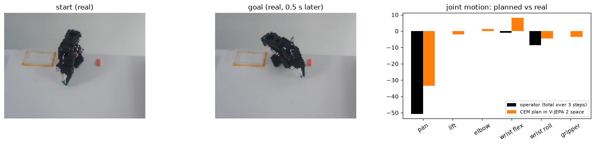

# Lecture 12 — V-JEPA 2 and V-JEPA 2-AC

> **Watch:** [Lecture 12 on YouTube](https://youtu.be/6S4O9WbcBvM) · [full playlist](https://www.youtube.com/playlist?list=PLahzD_BXtne4)
> **Paper:** Assran et al. (Meta FAIR, 2025) — [V-JEPA 2: Self-Supervised Video Models Enable Understanding, Prediction and Planning](https://arxiv.org/abs/2506.09985)
> **Code & checkpoints:** [facebookresearch/vjepa2](https://github.com/facebookresearch/vjepa2)

V-JEPA (Lecture 9) showed that predicting *features* of masked video beats predicting pixels. V-JEPA 2 asks
what happens when you scale that idea hard — **22 million videos, a 1-billion-parameter ViT-g, longer clips,
higher resolution** — and then turns the resulting encoder into a robot world model.

## The ideas in the lecture

- **Four scaling axes:** data (2M → 22M clips, VideoMix22M), model (ViT-L → ViT-g, ~1B), training length,
  and resolution (224 → 384 → 448 with progressive training). Each adds accuracy; together they make V-JEPA 2
  state of the art on motion understanding.
- **3D RoPE** replaces fixed position embeddings so one model handles different resolutions and clip lengths.
- **From understanding to acting — V-JEPA 2-AC:** freeze the encoder, and fine-tune an *action-conditioned*
  predictor on just **62 hours** of robot video (DROID). Actions and proprioception enter where the JEPA's
  latent variable used to be.
- **Two losses:** a *teacher-forcing* loss (predict z₁…z₄ from the true past) and a *rollout* loss (feed the
  model its own predictions, the way it will be used at planning time).
- **Planning:** give a start frame and a goal frame; CEM searches action sequences whose imagined final
  embedding is closest to the goal (L2 distance in representation space). Zero-shot pick-and-place on a
  Franka arm, beating the Octo VLA on grasp / reach / pick-and-place.
- **DINO-WM is a JEPA too** — encoder, predictor, match in latent space — but not end-to-end: its encoder is
  frozen from image pre-training instead of learned from the masking objective.
- **What's missing:** no hierarchy (H-JEPA), no language goals, and CEM is slow for long horizons.

## Project: plan a real SO-101 arm in V-JEPA 2's feature space (V-JEPA 2-AC, small scale)

| Notebook | What it does | Open |
|---|---|---|
| [`VJEPA2_AC_Planning_SO101.ipynb`](VJEPA2_AC_Planning_SO101.ipynb) | Freeze Meta's pretrained **V-JEPA 2 (ViT-L)** encoder, encode 50 real SO-101 pick-and-place episodes, train a 3.8M-parameter **action-conditioned predictor** with the lecture's two losses (teacher forcing + rollout), then **plan with CEM** from a start frame to a goal frame on 5 unseen episodes |  |

What our run on a free Colab T4 produced (≈8 minutes end to end, 7 minutes of robot data):

- **It imagines the future:** rolling the predictor 1 / 2 / 3 steps (up to 0.5 s) ahead from a single real frame is
  **15% / 19% / 22% closer** to the true future latents than assuming nothing moves.
- **It plans:** CEM, searching only in V-JEPA 2 latent space, picks motions whose direction matches the human
  operator's on **79% of the joints that actually moved**; its imagined end state is closer to the goal than doing
  nothing or acting randomly.
- **The honest caveat:** the planner's imagined path scores slightly *better* than the operator's real actions —
  it has started to exploit the predictor's errors, exactly the failure mode you fight with more data, longer
  rollout losses, and a real robot in the loop (what Meta's 62 hours and 1B-parameter encoder buy).

## Next

[Lecture 13 — LeWorldModel](../lecture-13-leworldmodel)
