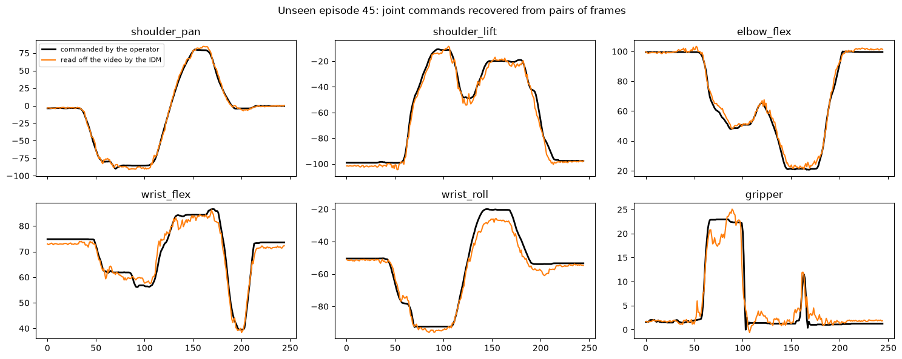

# Lecture 14 — Video World Models: Imagine, then Act

> **Watch:** [Lecture 14 on YouTube](https://youtu.be/Fq8YrqA64GI) · [full playlist](https://www.youtube.com/playlist?list=PLahzD_BXtne4)

Every world model so far was **action-conditioned**: it needs (observation, action) pairs to train, so it
can't learn from the internet's unlabelled video. **Paradigm 2** flips the order: a large video model,
pre-trained on internet video with *no actions*, imagines the future, and a small **inverse-dynamics**
model reads the actions off the imagined frames.

## The papers, in order

| Model | Idea in one line | Paper |
|---|---|---|
| **UniPi** (2023) | The policy *is* a text-conditioned video generator; a small MLP recovers actions from consecutive frames. Combinatorial generalisation to unseen colour/shape instructions | [arXiv:2302.00111](https://arxiv.org/abs/2302.00111) |
| **SuSIE** (2024) | Don't dream a whole video — edit the current image into one *sub-goal* ~2 s ahead (InstructPix2Pix), then a goal-conditioned diffusion policy closes the gap | [arXiv:2310.10639](https://arxiv.org/abs/2310.10639) |
| **π0.7** (2026) | Physical Intelligence's VLA borrows SuSIE's trick: a 14B world model (BAGEL) generates sub-goal images that condition the policy | [arXiv:2604.15483](https://arxiv.org/abs/2604.15483) |
| **HiP** (2023) | Three foundation models in a loop: an LLM proposes sub-goals, a video model dreams them, a VLM checks the video before inverse dynamics acts | [arXiv:2309.08587](https://arxiv.org/abs/2309.08587) |
| **GR-1 / GR-2** (2023–24) | One causal transformer pre-trained on internet video (38M clips for GR-2) with two heads: next frame *and* next action | [GR-1](https://arxiv.org/abs/2312.13139) · [GR-2](https://arxiv.org/abs/2410.06158) |
| **VPP** (2025) | Don't finish generating the video — use the video diffusion model's *intermediate features* as conditioning for a diffusion action policy | [arXiv:2412.14803](https://arxiv.org/abs/2412.14803) |

The arc: from two separate models (UniPi) → composed specialists (HiP) → one model with two heads (GR-1) →
"use the latent, not the pixels" (VPP). The next step erases the boundary entirely — that's
[Lecture 15](../lecture-15-dreamzero).

## How the inverse-dynamics model is trained

From any LeRobot dataset you already have (oₜ, aₜ, oₜ₊₁) triples; the interpreter is plain supervised
learning `f(oₜ, oₜ₊₁) → aₜ`. Pre-training the video model needs no actions at all; only this small model and
a short post-training stage need robot data.

## Project: read the actions off a video — train the inverse-dynamics interpreter

| Notebook | What it does | Open |
|---|---|---|
| [`Inverse_Dynamics_From_Video.ipynb`](Inverse_Dynamics_From_Video.ipynb) | Train UniPi's stage-2 **interpreter** `f(oₜ, oₜ₊₅) → aₜ` on 45 real SO-101 pick-and-place episodes, read the joint commands back off **5 unseen episodes**, then damage the "imagined" future frames to see why inverse dynamics is the brittle part |  |

What our run on a free Colab T4 produced (≈7 minutes end to end):

| Mean action error on unseen episodes | |
|---|---|
| IDM, pixels only | **2.35** |
| "copy the current joint state" (cheats: reads the arm's sensors) | 3.09 |
| "predict the average action" (no information) | 22.96 |

And the brittleness: blur the future frame and the error creeps up (2.65 → 3.83); add noise of the kind a
generator produces and it heads straight for the no-information line (6.2 → 16.5 → 22.5). That gap is what the
next paradigm closes — predicting video *and* actions jointly, in [Lecture 15](../lecture-15-dreamzero).
